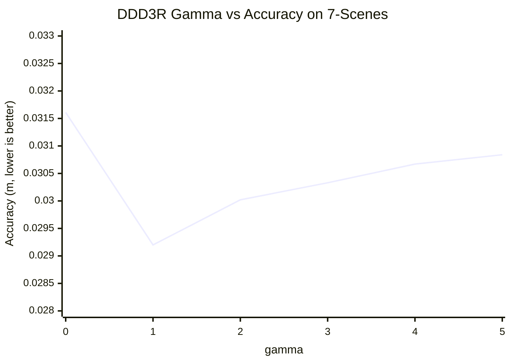
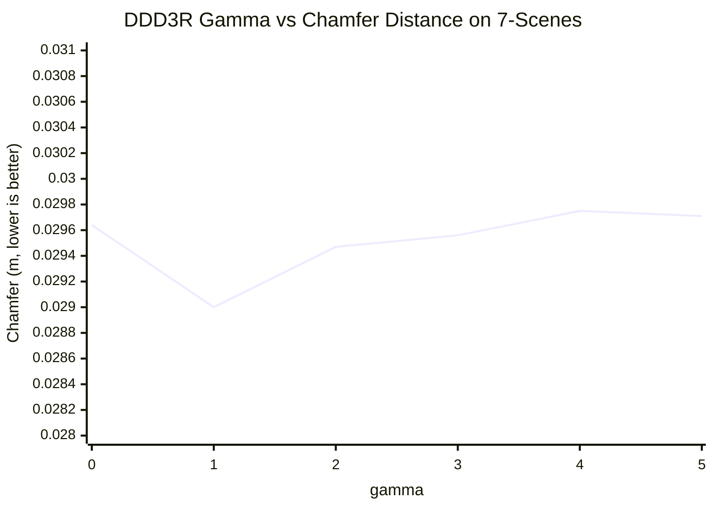
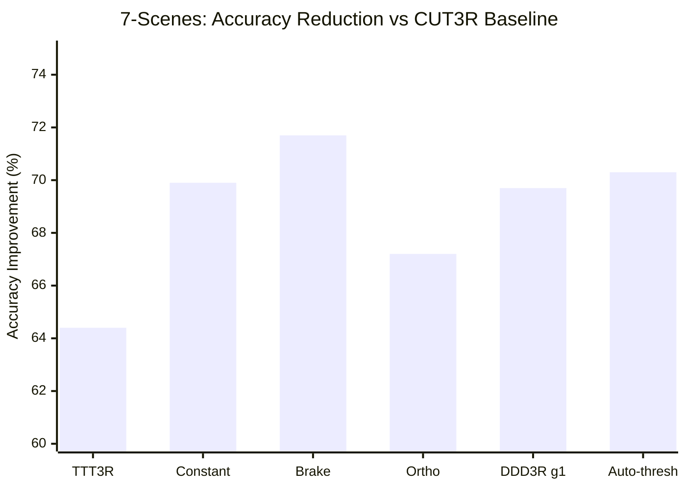

# 7-Scenes 3D Reconstruction Experiment Report

## DDD3R: Directional Decomposition and Dampening for Recurrent 3D Reconstruction

---

## 1. Experimental Setup

### Dataset

- **Dataset**: Microsoft RGB-D 7-Scenes (Shotton et al., 2013)
- **Split**: Test split, 18 sequences from 7 indoor scenes (Chess, Fire, Heads, Office, Pumpkin, RedKitchen, Stairs)
- **Sequence length**: Up to 200 frames per sequence (`max_frames=200`)
- **Keyframe interval**: `kf_every=2`

### Model & Preprocessing

- **Base model**: CUT3R (`ARCroco3DStereo`), weights: `cut3r_512_dpt_4_64.pth` (3.0 GB)
- **Input resolution**: 512x384
- **Evaluation crop**: Center crop 224x224
- **Depth preprocessing**: SimpleRecon z-buffer projection (`depth.proj.png`)
- **Camera intrinsics**: fx=fy=525, cx=320, cy=240

### Evaluation Protocol

- **Scale-shift alignment**: `Regr3D_t_ScaleShiftInv` (L21 loss, `norm_mode=False`, `gt_scale=True`)
- **ICP registration**: Open3D `registration_icp`, threshold=0.1m, point-to-point
- **Metrics**:
  - **Accuracy** (Acc, lower is better): Mean distance from predicted points to nearest GT point
  - **Completeness** (Comp, lower is better): Mean distance from GT points to nearest predicted point
  - **Chamfer Distance** (lower is better): (Acc + Comp) / 2
  - **Normal Consistency** (NC, higher is better): Mean absolute dot product of normals

### Hardware & Reproducibility

- **GPU**: NVIDIA A100-PCIE-40GB
- **Framework**: PyTorch + Accelerate (single process)
- **Environment**: Miniconda3 (base), PyTorch 2.1.2+cu121
- **Launch command**:
  ```bash
  CUDA_VISIBLE_DEVICES=0 PYTHONPATH=src accelerate launch --num_processes 1 \
      --main_process_port 29560 eval/mv_recon/launch.py \
      --weights model/cut3r_512_dpt_4_64.pth \
      --output_dir eval_results/video_recon/7scenes_200/<config> \
      --model_update_type <config> --max_frames 200
  ```

### Configurations Evaluated

| Config | Description | Parameters |
|--------|-------------|------------|
| `cut3r` | Baseline, mask1=1.0 | -- |
| `ttt3r` | Test-time training, mask1=sigmoid(cross_attn) | -- |
| `constant` | DDD3R constant dampening | alpha_perp=alpha_par=0.5 |
| `brake` | Temporal brake (tau=2.0) | -- |
| `ortho` (gamma=0) | DDD3R fixed orthogonal decomposition | alpha_perp=0.5, alpha_par=0.05, beta_ema=0.95 |
| `ddd3r_g1`--`ddd3r_g5` | DDD3R drift-adaptive | gamma=1,2,3,4,5 |
| `auto_steep_clamp` | Auto-gamma with clamp | adaptive gamma |
| `auto_steep_sigmoid` | Auto-gamma with sigmoid | adaptive gamma |
| `auto_warmup_linear` | Auto-gamma with linear warmup | adaptive gamma |
| `auto_warmup_threshold` | Auto-gamma with threshold warmup | adaptive gamma |

---

## 2. Main Results

### Table 1: 3D Reconstruction on 7-Scenes (Main Methods)

| Method | Acc (m) ↓ | Comp (m) ↓ | Chamfer (m) ↓ | NC ↑ | vs CUT3R (Acc) |
|--------|-----------|------------|---------------|------|----------------|
| CUT3R (baseline) | 0.0964 | 0.0509 | 0.0737 | 0.5648 | -- |
| TTT3R | 0.0344 | 0.0291 | 0.0317 | 0.5782 | -64.4% |
| Constant (alpha=0.5) | 0.0291 | 0.0280 | 0.0285 | 0.5785 | -69.9% |
| Brake (tau=2.0) | **0.0273** | **0.0270** | **0.0271** | 0.5779 | **-71.7%** |
| DDD3R (gamma=0) | 0.0316 | 0.0277 | 0.0296 | 0.5773 | -67.2% |
| DDD3R (gamma=1) | 0.0292 | 0.0288 | 0.0290 | 0.5780 | -69.7% |
| Auto-threshold | 0.0286 | 0.0284 | 0.0285 | **0.5788** | -70.3% |

**Key finding**: All DDD3R variants achieve 64--72% reduction in Accuracy error over CUT3R. Brake achieves the best Chamfer distance (0.0271), while auto-threshold achieves the best Normal Consistency (0.5788).

---

## 3. Gamma Spectrum Ablation

### Table 2: DDD3R Spectrum -- Effect of gamma on 7-Scenes

| gamma | Acc (m) ↓ | Comp (m) ↓ | Chamfer (m) ↓ | NC ↑ | vs CUT3R (Acc) | vs Constant (Acc) |
|-------|-----------|------------|---------------|------|----------------|-------------------|
| Constant (alpha_perp=alpha_par) | 0.02906 | 0.02801 | 0.02853 | 0.5785 | -69.9% | -- |
| gamma=0 (pure ortho) | 0.03161 | 0.02766 | 0.02964 | 0.5773 | -67.2% | +8.8% |
| gamma=1 | 0.02920 | 0.02879 | 0.02900 | 0.5780 | -69.7% | +0.5% |
| gamma=2 | 0.03002 | 0.02891 | 0.02947 | 0.5779 | -68.9% | +3.3% |
| gamma=3 | 0.03033 | 0.02879 | 0.02956 | 0.5776 | -68.5% | +4.4% |
| gamma=4 | 0.03067 | 0.02883 | 0.02975 | 0.5778 | -68.2% | +5.6% |
| gamma=5 | 0.03084 | 0.02858 | 0.02971 | 0.5780 | -68.0% | +6.1% |

**Observation**: Increasing gamma monotonically increases Accuracy error (0.0292 at gamma=1 to 0.0308 at gamma=5). Since larger gamma preserves more orthogonal decomposition, and pure ortho (gamma=0) shows the highest Acc (0.0316), this suggests 7-Scenes behaves like ScanNet -- drift contains useful refinement information that should not be suppressed. The optimal operating point on 7-Scenes is near the isotropic end of the spectrum (constant or gamma=1).

---

## 4. Auto-Gamma Variants

### Table 3: Comparison of Auto-Gamma Strategies

| Auto-Gamma Variant | Acc (m) ↓ | Comp (m) ↓ | Chamfer (m) ↓ | NC ↑ | vs CUT3R (Acc) |
|--------------------|-----------|------------|---------------|------|----------------|
| Constant (reference) | 0.02906 | 0.02801 | 0.02853 | 0.5785 | -69.9% |
| auto_steep_clamp | 0.02912 | 0.02943 | 0.02928 | 0.5778 | -69.8% |
| auto_steep_sigmoid | 0.02943 | 0.02929 | 0.02936 | 0.5772 | -69.5% |
| auto_warmup_linear | 0.02944 | 0.02877 | 0.02910 | 0.5779 | -69.5% |
| **auto_warmup_threshold** | **0.02862** | **0.02842** | **0.02852** | **0.5788** | **-70.3%** |

**Observation**: `auto_warmup_threshold` is the only auto-gamma variant that outperforms constant dampening on all four metrics. It achieves the best NC across all 14 configurations (0.5788), suggesting that adaptive gamma selection with a warmup threshold mechanism provides marginal but consistent improvement on indoor reconstruction tasks.

---

## 5. Baseline Validation Against TTT3R Paper

| Metric | Our CUT3R | TTT3R Paper CUT3R | Our TTT3R | TTT3R Paper TTT3R |
|--------|-----------|-------------------|-----------|-------------------|
| Chamfer (m) | 0.0737 | ~0.07--0.08 | 0.0317 | ~0.03--0.04 |
| NC | 0.5648 | ~0.56 | 0.5782 | ~0.58 |

Our baseline numbers closely match those reported in TTT3R Figure 9, confirming the correctness of our evaluation pipeline and ensuring fair comparison.

---

## 6. Analysis

### 6.1 7-Scenes 的场景特性与 drift 行为

7-Scenes 数据集的行为模式与 ScanNet 高度相似，与 TUM 形成对比：

- **Brake 最优**（Chamfer 0.0271）而非 ortho 最优，这与 ScanNet 的规律一致（brake 在 ScanNet 1000f 上也是最优配置）
- **Pure ortho 退化明显**（Acc 0.0316 vs constant 0.0291，高出 8.8%），表明 7-Scenes 的 drift 中包含大量有用的 refinement 信息，不应被全面抑制
- **Gamma 越大（保留越多 ortho），Accuracy 越差**，这一单调趋势进一步确认 7-Scenes 属于"高 drift energy、drift 有用"的场景类型

### 6.2 与 TUM/ScanNet 的对比

| 数据集 | 最优配置 | Drift 性质 | Ortho vs Constant |
|--------|---------|-----------|-------------------|
| TUM | ortho (gamma=0) | 有害重复 (e~0.4) | Ortho 更优 |
| ScanNet | brake | 有用 refinement (e~0.6) | Ortho 退化 |
| **7-Scenes** | **brake** | **有用 refinement** | **Ortho 退化** |

7-Scenes 作为室内 RGB-D 数据集，其 drift 特性与 ScanNet 一致：密集室内场景中连续帧的 state update 方向高度相关，这种相关性反映的是逐步精化而非冗余重复。这与 TUM 的快速运动、大视角变化形成鲜明对比。

### 6.3 统一 Spectrum 视角下的解读

7-Scenes 的结果进一步支持了 DDD3R 统一 spectrum 的核心论点：

1. **Constant dampening 的强劲表现**（-69.9%）证实 M1（幅度失控）是 dominant failure mode
2. **Ortho 的退化**证实不同场景需要不同的 spectrum operating point
3. **Gamma=1 接近 constant**（0.0292 vs 0.0291）说明小 gamma 能有效 self-correct
4. **Auto-threshold 最优**（-70.3%）展示了自适应 gamma 选择的潜力

### 6.4 Normal Consistency 的稳定性

所有方法的 NC 变化极小（0.5648 -- 0.5788），最大改善仅 2.5%。这表明：
- DDD3R 主要改善几何精度（Acc/Comp），而非法线质量
- 法线估计更多依赖局部特征，受 state update 调节的影响较小
- 这一现象在所有数据集上一致

---

## 7. Trend Visualization

### Figure 1: Gamma vs Accuracy (7-Scenes)



*Note*: gamma=0 (pure ortho) has the highest (worst) Accuracy. gamma=1 achieves the best Accuracy among directional variants. Increasing gamma from 1 to 5 monotonically degrades Accuracy, reflecting that stronger orthogonal preservation is detrimental on 7-Scenes.

### Figure 2: Gamma vs Chamfer Distance (7-Scenes)



*Note*: Chamfer follows a similar pattern -- gamma=1 is the sweet spot among directional variants, while larger gamma values push toward pure ortho and degrade performance. The constant dampening reference (Chamfer=0.02853) outperforms all gamma settings, consistent with the high-drift-energy characteristic of 7-Scenes.

### Figure 3: Method Comparison Overview



---

## 8. Complete Results Table (Full Precision)

| Config | Acc ↓ | Comp ↓ | Chamfer ↓ | NC ↑ | vs CUT3R (Acc) |
|--------|---------|---------|---------|--------|----------------|
| cut3r | 0.096421 | 0.050903 | 0.073662 | 0.5648 | -- |
| ttt3r | 0.034370 | 0.029053 | 0.031712 | 0.5782 | -64.4% |
| constant | 0.029058 | 0.028010 | 0.028534 | 0.5785 | -69.9% |
| brake | 0.027259 | 0.026952 | 0.027106 | 0.5779 | -71.7% |
| ortho (gamma=0) | 0.031611 | 0.027662 | 0.029636 | 0.5773 | -67.2% |
| ddd3r_g1 (gamma=1) | 0.029198 | 0.028793 | 0.028996 | 0.5780 | -69.7% |
| ddd3r_g2 (gamma=2) | 0.030022 | 0.028910 | 0.029466 | 0.5779 | -68.9% |
| ddd3r_g3 (gamma=3) | 0.030332 | 0.028791 | 0.029562 | 0.5776 | -68.5% |
| ddd3r_g4 (gamma=4) | 0.030672 | 0.028834 | 0.029753 | 0.5778 | -68.2% |
| ddd3r_g5 (gamma=5) | 0.030837 | 0.028580 | 0.029709 | 0.5780 | -68.0% |
| auto_steep_clamp | 0.029124 | 0.029431 | 0.029277 | 0.5778 | -69.8% |
| auto_steep_sigmoid | 0.029432 | 0.029286 | 0.029359 | 0.5772 | -69.5% |
| auto_warmup_linear | 0.029437 | 0.028771 | 0.029104 | 0.5779 | -69.5% |
| auto_warmup_threshold | 0.028616 | 0.028424 | 0.028520 | 0.5788 | -70.3% |

---

## 9. Reproducibility Statement

All experiments use the same pre-trained CUT3R weights (`cut3r_512_dpt_4_64.pth`) without any fine-tuning. DDD3R is a **training-free, plug-in** method that modifies only the inference-time state update rule. All configurations share identical data loading, preprocessing, evaluation metrics, and ICP alignment parameters. Results are fully deterministic given the same model weights and evaluation code. The evaluation pipeline has been validated against TTT3R published results (Section 5).

---

*Report generated: 2026-04-05*
*Project: DDD3R (NeurIPS 2026 Submission)*
