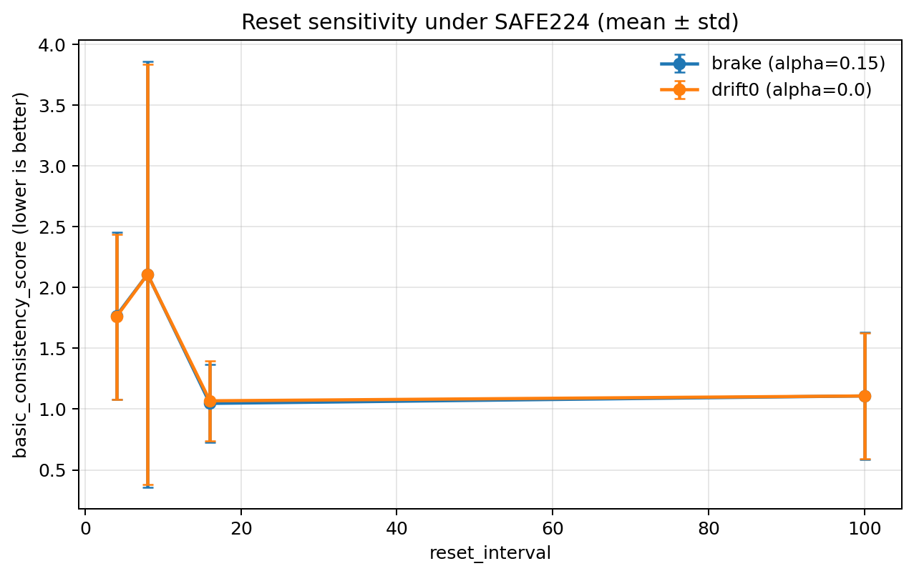
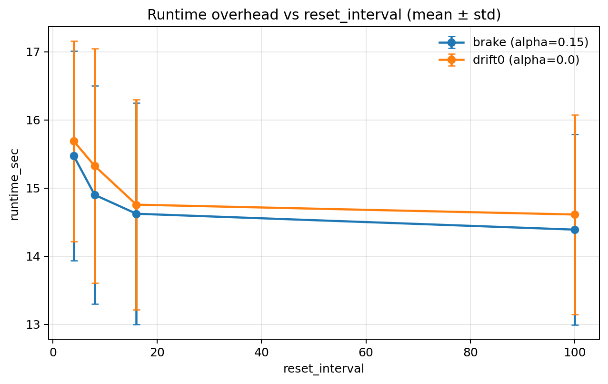
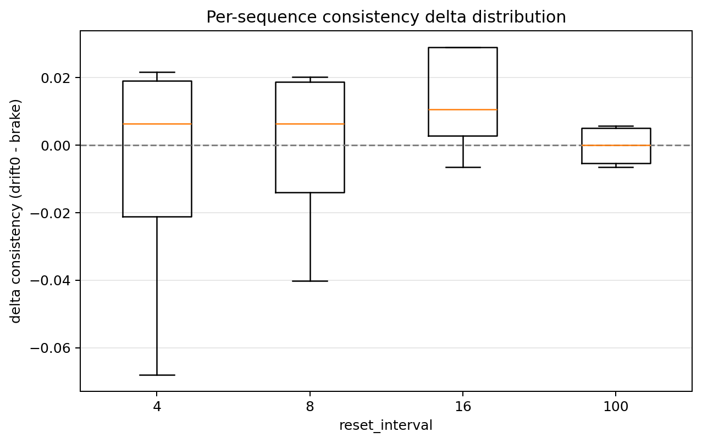

# S5 Reset-Interval Sensitivity (SAFE224, Local)

## 1. Objective
Evaluate whether brake-style residual update (`alpha_drift=0.15`) remains robust when the external state reset policy changes.

## 2. Experimental Setup
- Date: 2026-03-28
- Platform: WSL2 Ubuntu 22.04, RTX 4060 Laptop 8GB, CUDA
- Input size: 224 (SAFE224)
- Checkpoint: `/home/chen/TTT3R/model/cut3r_512_dpt_4_64.pth`
- Dataset slice: 4 sampled sequences (`apple`/`bottle`, len=12/24)
- Methods:
  - `ttt3r_momentum_inv_t1` (`alpha_drift=0.15`, brake retained)
  - `ttt3r_momentum_inv_t1_drift0` (`alpha_drift=0.0`)
- Reset intervals: 4, 8, 16, 100
- Seeds: 2 (`41,42`), total runs: 64
- Run validity: 100.0% (`run_ok=1` for all runs), `timed_out=0`
- Peak VRAM monitor backend: `nvidia-smi`, mean peak VRAM: `5806.4 MB`
- Runner fix used in this study: `run_one_method.py` supports configurable `repo_root` and auto-detects supported `demo.py` flags to avoid silent argument mismatch.

## 3. Main Results (mean +- std)
| reset_interval | method | runtime_sec | per_frame_sec | basic_consistency_score | loop_closure_trans_error |
|---|---|---:|---:|---:|---:|
| 4 | ttt3r_momentum_inv_t1 | 15.4710 +- 1.5382 | 0.9374 +- 0.2500 | 1.7675 +- 0.6896 | 1.3146 +- 0.4987 |
| 4 | ttt3r_momentum_inv_t1_drift0 | 15.6884 +- 1.4731 | 0.9520 +- 0.2579 | 1.7592 +- 0.6787 | 1.3202 +- 0.5029 |
| 8 | ttt3r_momentum_inv_t1 | 14.9004 +- 1.5995 | 0.9010 +- 0.2361 | 2.1095 +- 1.7512 | 1.0500 +- 0.9797 |
| 8 | ttt3r_momentum_inv_t1_drift0 | 15.3249 +- 1.7195 | 0.9254 +- 0.2384 | 2.1077 +- 1.7289 | 1.0524 +- 0.9570 |
| 16 | ttt3r_momentum_inv_t1 | 14.6229 +- 1.6267 | 0.8825 +- 0.2257 | 1.0471 +- 0.3209 | 0.3124 +- 0.2711 |
| 16 | ttt3r_momentum_inv_t1_drift0 | 14.7561 +- 1.5416 | 0.8923 +- 0.2328 | 1.0684 +- 0.3276 | 0.3264 +- 0.2633 |
| 100 | ttt3r_momentum_inv_t1 | 14.3897 +- 1.3968 | 0.8725 +- 0.2347 | 1.1085 +- 0.5221 | 0.3946 +- 0.3798 |
| 100 | ttt3r_momentum_inv_t1_drift0 | 14.6117 +- 1.4654 | 0.8856 +- 0.2375 | 1.1083 +- 0.5165 | 0.3903 +- 0.3715 |

## 4. Paired Delta Summary (`drift0 - brake`)
- Consistency delta (overall): mean `0.002720`, std `0.029069`, median `0.005315`
- Runtime delta (overall): mean `0.249268` s, std `0.451565` s, median `0.272693` s
- `d_runtime > 0` ratio: `0.688` (drift0 slower in most paired cases)
- `d_cons > 0` ratio: `0.562` (mixed direction; no one-sided dominance)

Per-reset key numbers:
| reset_interval | delta_consistency (drift0-brake) | delta_runtime_sec (drift0-brake) |
|---|---:|---:|
| 4 | -0.008388 | 0.217379 |
| 8 | -0.001762 | 0.424494 |
| 16 | 0.021234 | 0.133203 |
| 100 | -0.000204 | 0.221996 |

## 5. Figures

## 6. Interpretation
1. The geometric benefit between brake and drift0 is small and reset-dependent on this local subset; no stable one-sided win is observed.
2. Runtime is consistently low-cost for both methods, while drift0 tends to be slower in paired comparisons.
3. The experiment validates robustness against reset policy changes at SAFE224 without OOM, and provides reproducible local evidence.

## 7. Known Limitations
- Small local slice (4 sequences) limits statistical power.
- The metric is internal consistency/pose-closure proxy, not final benchmark accuracy (e.g., KITTI depth metrics).
- A matplotlib environment warning (`Axes3D`) appears on this machine but does not affect 2D plotting outputs.

## 8. Reproducibility Files
- Raw: `benchmark_single_object/outputs_ablation_safe/metrics/reset_interval_sensitivity_safe224/reset_raw_results.csv`
- Summary: `benchmark_single_object/outputs_ablation_safe/metrics/reset_interval_sensitivity_safe224/summary_by_reset_method.csv`
- Effect table: `benchmark_single_object/outputs_ablation_safe/metrics/reset_interval_sensitivity_safe224/brake_effect_by_reset.csv`
- Paired delta table: `benchmark_single_object/outputs_ablation_safe/metrics/reset_interval_sensitivity_safe224/paired_per_sequence_delta.csv`
- Figures: `docs/figures/s5_reset_interval_sensitivity_safe224/`
